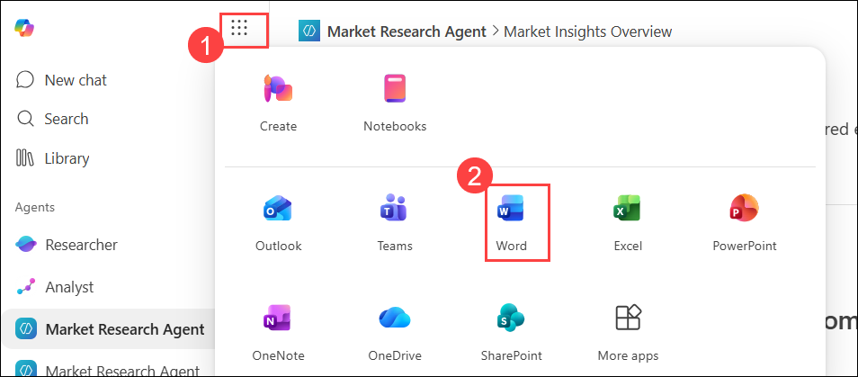
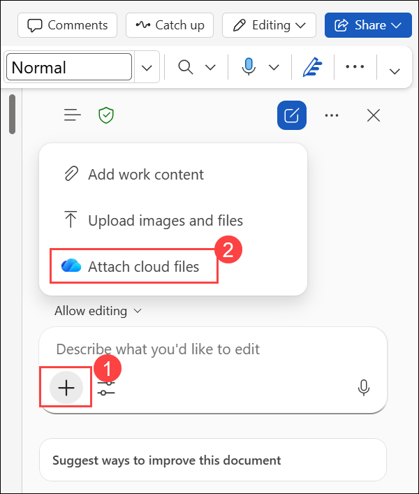
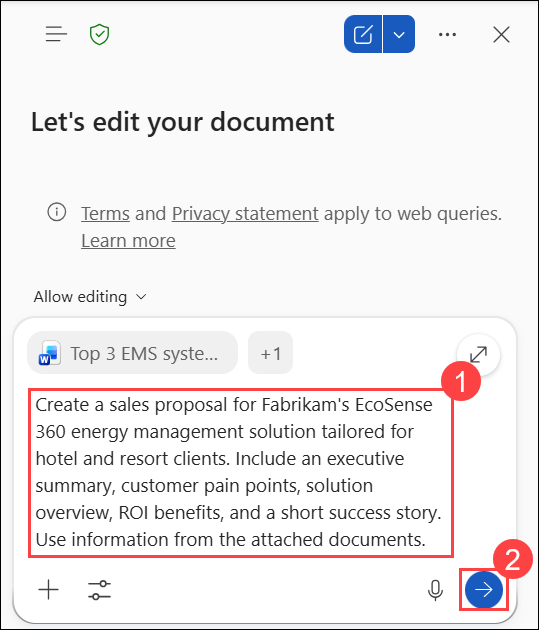

# Exercise 1, Task 3: Use Copilot in Word to create a sales proposal

## Overview

Now that you built a strong understanding of the market and competition, Fabrikam’s regional Sales director asks you to prepare a client-ready proposal that can be used in upcoming sales meetings with hotel groups. The proposal should clearly articulate EcoSense 360’s value, highlight customer benefits, and demonstrate the potential return on investment (ROI).

You want to use Copilot in Word to transform your research findings into a professional, persuasive sales proposal. You want it to be visually clean, executive-friendly, and tailored to hotel decision makers.

### Using Copilot in Word

Copilot in Word can behave in two different ways, depending on whether **Edit with Copilot** is enabled. Understanding this distinction is important, because it affects whether Copilot can automatically apply changes to your document or just provide suggestions for you to use.

When **Edit with Copilot** is enabled, Copilot acts as an in-document author and editor. You can ask Copilot to create a document from scratch, rewrite sections, add summaries, or refine language—and it can apply those changes directly to the document, typically with your confirmation. In this experience, Copilot behaves like a collaborative writing partner that can both generate and revise content without requiring manual copy and paste. This is commonly the experience when prompting Copilot from within a Word document, such as using the drafting prompt above a blank document or the prompt field in the Copilot pane.

When **Edit with Copilot** is disabled, Copilot behaves more like Copilot Chat. It can still research topics, summarize information, and draft text, but it doesn’t automatically modify the document. Instead, responses appear in the Copilot pane, and you decide what—if anything—gets added to the document. This approach is useful when you want Copilot to act as a research assistant or idea generator while maintaining full control over what content is inserted.

This task uses the **Edit with Copilot** functionality. 

Perform the following steps to complete this task:

1. In your Microsoft Edge browser, go to the **Microsoft 365** home page, select **App launcher (1)** in the navigation pane, and then select **Word (2)** from the **Apps** menu.

     

2. In **Word for the web**, create a blank document.

3. On the **Home** tab ribbon, select **Copilot**. In the Copilot pane, verify the **Edit with Copilot** icon appears in the prompt field next to the plus (+) sign. If you don’t see it, select the plus sign and then select **Edit with Copilot** in the drop-down menu. The icon should now appear in the prompt field.

     

1. Select **Add (1)**, and then choose **Attach cloud files (2)**.

     

1. In **My files (1)**, select **Top 3 EMS systems (2)** and **EcoSense360 market research (3)**, and then click **Select (4)**.

     

4. In the prompt field that appears in the Copilot pane, provide the following prompt **(1)** and select **Send (2)** 

    ```
    Create a sales proposal for Fabrikam's EcoSense 360 energy management solution tailored for hotel and resort clients. Include an executive summary, customer pain points, solution overview, ROI benefits, and a short success story. Use information from the attached documents.
    ```

     

1. Review the proposal generated by Copilot. Notice that while the proposal includes a section on customer pain points, it does not explain how **EcoSense 360** addresses those challenges. After reviewing the content, select **Done**.

     

1. In the Copilot prompt field, ask Copilot to **update the Customer Pain Points section to include how the EcoSense 360 solution addresses each pain point**.

    

6. Review the results. While you feel the proposal provides a good foundation, you feel that it’s missing a couple of key items that might concern executives. Ask Copilot

    ```
    Rewrite this proposal for a C-suite audience focused on operational efficiency and sustainability. Also add a summary table showing estimated ROI for hotels of different sizes.
    ```

7. Review the results. The one thing that you might need to manually change is in the pain points section (which might be retitled to something else, such as Key Operational Challenges). If Copilot includes a bullet for how EcoSense 360 addresses each pain point, ensure the EcoSense 360 impact bullet is indented below its parent pain point bullet. That way, the bulleted list clearly draws attention to the EcoSense 360 solution for each pain point, as opposed to having what appears to be just a continuous string of bullets. For example:  
    <br/>If your current version appears something like this:
    - **High Energy Cost:** Hotels are facing rising energy expenses…
    - **EcoSense 360 Impact:** AI-driven optimization…
    - **HVAC Inefficiency:** Outdated or disconnected climate controls…
    - **EcoSense 360 Impact:** Integrated system connects with…  

    Then indent each **EcoSense 360 Impact** bullet like this:

    - **High Energy Cost:** Hotels are facing rising energy expenses…
        - **EcoSense 360 Impact:** AI-driven optimization…
    - **HVAC Inefficiency:** Outdated or disconnected climate controls…
        - **EcoSense 360 Impact:** Integrated system connects with…  

8. Save the final version of your document as **EcoSense360 Hospitality Proposal.docx**.

    
