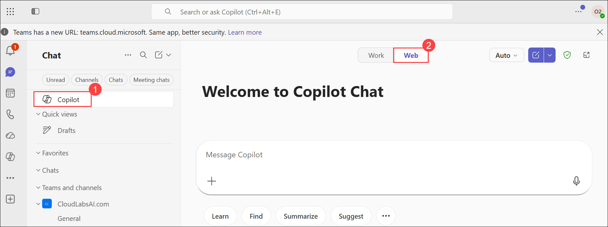
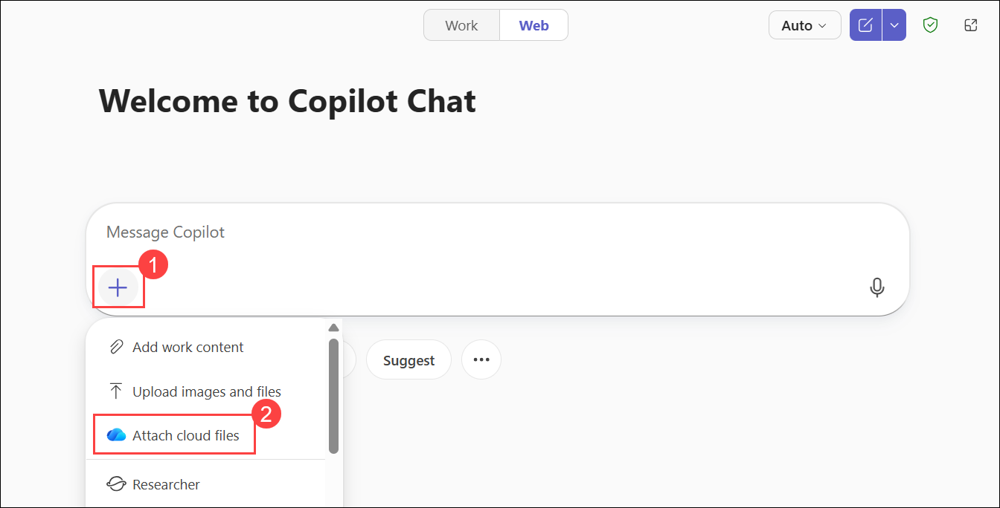
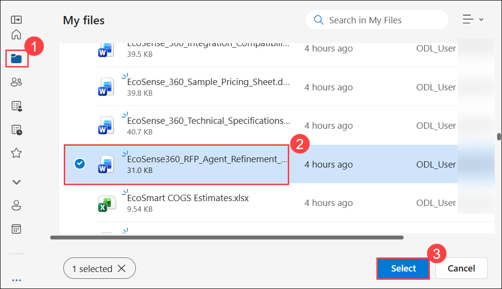
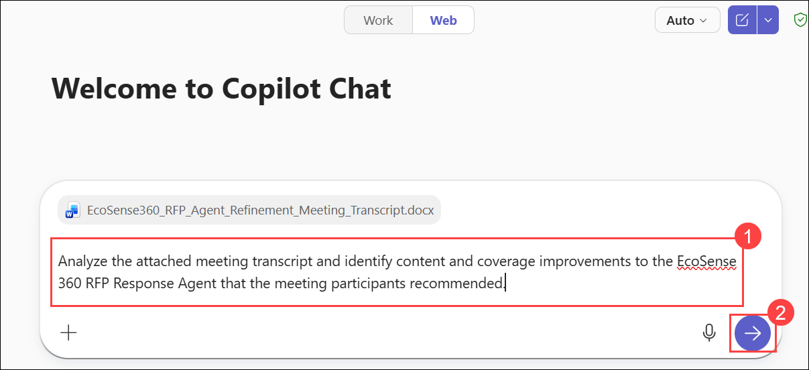
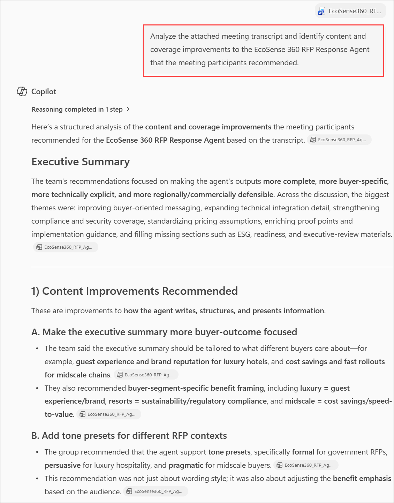

# Exercise 2, Task 4: Use Copilot in Teams to collaborate on refining the RFP response agent

## Overview

In this task, you take on the role of Riley Ramirez, Sales Director for Fabrikam’s Hospitality division. Now that the Sales team built its first version of the EcoSense 360 RFP Response Agent, you held a Teams meeting with colleagues from Sales, Product Management, and Engineering to gather feedback. You demonstrated the agent and the results that it provided for several client RFPs. The group then discussed how well the agent answered technical and business questions, identified areas for improvement, and agreed on next steps.

As part of your post-meeting analysis, you plan to use Copilot in Teams to review the meeting transcript and summarize key discussion points, capture suggested changes, and generate a list of follow-up actions. Doing so ensures that every idea and piece of feedback is documented, which helps your team iterate quickly and refine the agent into a valuable sales asset.

Perform the following steps to complete this task:

1. In your Microsoft Edge browser, go to the **Microsoft 365** home page, select **App launcher** in the navigation pane, and then select **Teams** from the **App launcher** menu.

4. In **Teams for the web**, select the **Copilot (1)** icon in the navigation pane. In the Copilot window, ensure the **Work (2)** toggle is selected. 

    

1. In Copilot Chat, select **Add (1)**, and then choose **Attach cloud files (2)** to browse and attach a file from OneDrive.

   

1. In **My files (1)**, select **EcoSense360_RFP_Agent_Refinement_Template.docx (2)**, and then click **Select (3)**.

   

1. Once the files are uploaded, provide the following prompt **(1)** and then click on **Send (2)**:

   ```
   Analyze the attached meeting transcript and identify content and coverage improvements to the EcoSense 360 RFP Response Agent that the meeting participants recommended.
   ```

   

6. Review the results. There were many recommendations, so ask Copilot.

   

   ```
   Identify the top five recommendations that would have the biggest impact on improving the EcoSense 360 RFP Response Agent.
   ```

7. Review the results. Your plan is to update the Instructions for the agent, so you need to reformat these insights from bulleted lists into paragraph form that you can insert into the agent’s instructions. Ask Copilot.

   ```
   Convert these top five improvements into paragraph form so that I can include them as instructions for the EcoSense 360 RFP Response Agent in Copilot Studio.
   ```

8. If Copilot returns the top five improvements in a code block, select the **Copy code** icon that appears at the top of the form.

9. You’re now ready to complete the final task in this exercise, which updates the instructions for the EcoSense 360 RFP Response Agent.


