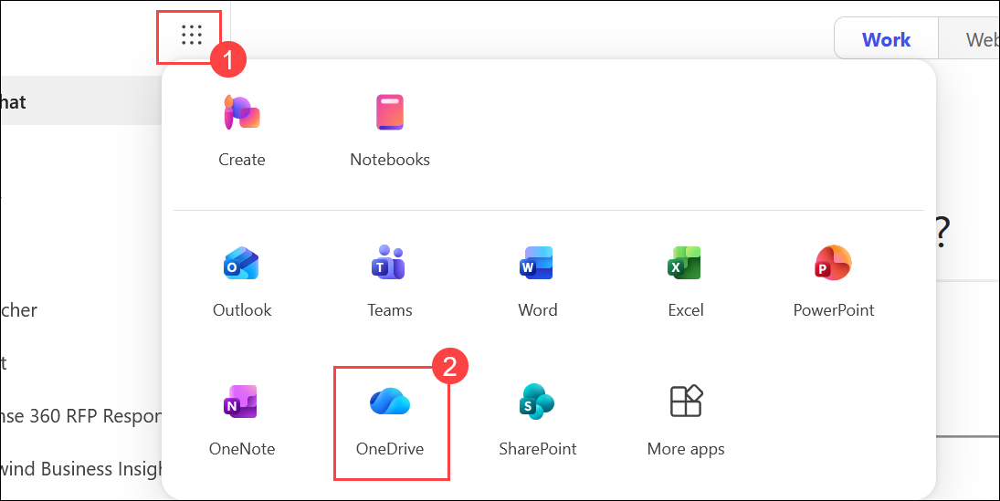
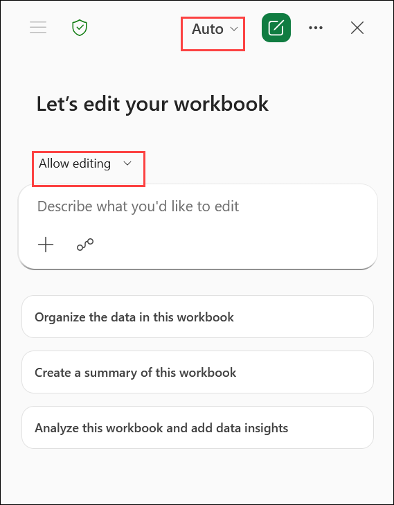
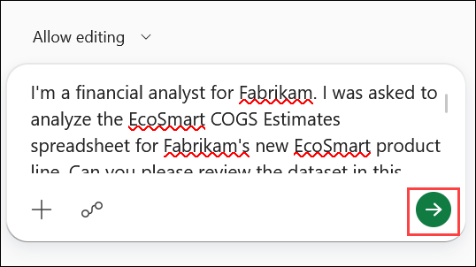
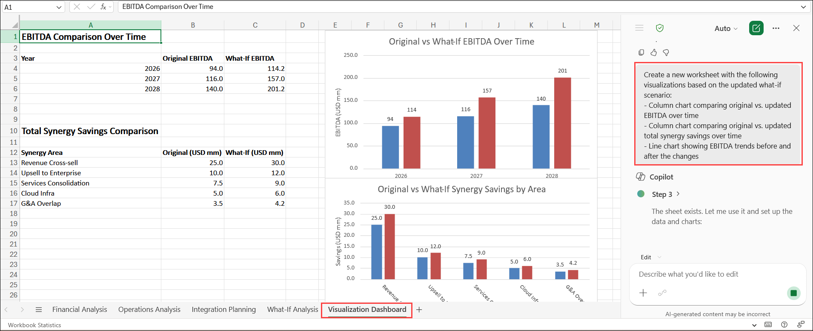
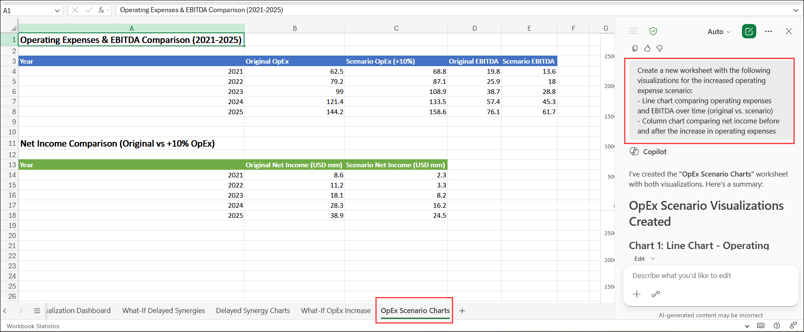

# Exercise 1, Task 4: Use Copilot in Excel to model What-If scenarios

Robin Kline, Fabrikam's Finance Manager, asked you to update the Relecloud acquisition financials to reflect new assumptions, such as adjusted valuation multiples and projected synergy savings. Robin wants you to:

- Update the Relecloud acquisition numbers based on a series of what-if scenarios.
- Create charts that visualize the effect of these changes.

This task showcases Copilot's ability to perform dynamic modeling and visualization, which are essential tools for any financial analyst preparing data-driven recommendations.

## Steps

1. Select the following link to download the [**Relecloud Acquisition Financials.xlsx**](https://go.microsoft.com/fwlink/?linkid=2347812) file. Store the file in your **OneDrive** account for use by Copilot in your tenant.

1. In your **Microsoft Edge** browser, navigate to the Microsoft 365 home page:

    ```
    https://www.microsoft365.com
    ```

1. Enter the following credentials to sign in to Microsoft 365:

    - **Email/Username**: **<inject key="AzureAdUserEmail"></inject>**

    - **Password**: **<inject key="AzureAdUserPassword"></inject>**

1. In the Microsoft 365 portal, click on the **App launcher (1)** button and select **Excel (2)**.

    

1. In **Excel for the web**, select the **Upload a file** button, navigate to your **OneDrive**, and then select the **Relecloud Acquisition Financials** spreadsheet that you downloaded in Step 1.

    

1. On the **Home** tab ribbon, select **Copilot** to open the Copilot pane. Leave the response mode selector set to **Auto**. Then verify the **Edit with Copilot** icon appears in the prompt field next to the plus **(+)** sign.

    

    > **`Note:`** If you don't see the **Edit with Copilot** icon, select the **plus (+)** sign and then select **Edit with Copilot** in the drop-down menu. The icon should now appear in the prompt field.

    

### What-If Scenario 1: EBITDA Multiple and Synergy Savings

1. Verify you're in the **Financial Analysis** sheet. In the Copilot prompt field, enter a prompt asking Copilot to perform a what-if scenario by updating the Relecloud acquisition financials to reflect a **1x increase in the EBITDA (earnings before interest, taxes, depreciation, and amortization) multiple** and a **20% increase in synergy savings**. Ask it to return the results in a new sheet.

    

1. Review the results. Remain in the new what-if sheet and enter a prompt asking Copilot to generate the following charts in a new sheet to make it easy to visualize the magnitude and timing of improvements:

    - **Column Chart** comparing original vs. updated EBITDA and total synergy savings over time
    - **Line Chart** showing EBITDA trend before and after the change

    

1. Review the charts generated by Copilot.

### What-If Scenario 2: Delayed and Reduced Synergy Savings

1. Select the **Financial Analysis** sheet to return to the base dataset. Enter a prompt asking Copilot to perform a what-if scenario that updates the acquisition financial model based on the following assumption: **synergy savings are delayed by 12 months and only 75% are realized**. Ask it to return the results in a new sheet.

    

1. Review the results. Remain in the new what-if sheet and enter a prompt asking Copilot to generate the following charts in a new sheet that show both the timing and reduction in benefits, highlighting the impact on cash flow and ROI:

    - **Stacked Column Chart** showing annual synergy savings (original vs. delayed/reduced)
    - **Line Chart** for cumulative synergy savings over time

    

1. Review the charts generated by Copilot.

### What-If Scenario 3: Higher Operating Expenses Due to Integration Challenges

1. Select the **Financial Analysis** sheet to return to the base dataset. Enter a prompt asking Copilot to perform a what-if scenario that updates the financial model based on **operating expenses that are 10% higher due to integration challenges**. Ask it to return the results in a new sheet.

    

1. Review the results. Remain in the new what-if sheet and enter a prompt asking Copilot to generate the following charts in a new sheet that highlight the effect on profitability and expense trends:

    - **Line Chart** for operating expenses and EBITDA over time (original vs. scenario)
    - **Column Chart** comparing net income before and after the change

    

1. Review the charts generated by Copilot. Feel free to select any of Copilot's suggested follow-up prompts if you want to update the spreadsheet even further.

1. You have now completed **Task 4**.

## Summary

In this task, you used **Copilot in Excel** with the **Edit with Copilot** functionality to model three what-if scenarios against the Relecloud acquisition financials. You:

- Modeled the impact of a **1x EBITDA multiple increase and 20% synergy savings increase**, with supporting column and line charts.
- Modeled the effect of **synergy savings delayed by 12 months and reduced to 75% realization**, with stacked column and cumulative line charts.
- Modeled the consequence of **operating expenses rising 10% due to integration challenges**, with profitability and expense trend charts.

These scenarios demonstrate how Copilot in Excel enables financial analysts to rapidly test assumptions, visualize outcomes, and prepare data-driven recommendations for leadership - without manually rebuilding financial models from scratch.

## Support Contact

The **CloudLabs support** team is available 24/7, 365 days a year, via email and live chat to ensure seamless assistance at any time. We offer dedicated support channels tailored specifically for both learners and instructors, ensuring that all your needs are promptly and efficiently addressed.

Learner Support Contacts:

- Email Support: [cloudlabs-support@spektrasystems.com](mailto:cloudlabs-support@spektrasystems.com)
- Live Chat Support: https://cloudlabs.ai/labs-support

Click **Next** from the bottom right corner to proceed to the next task!

