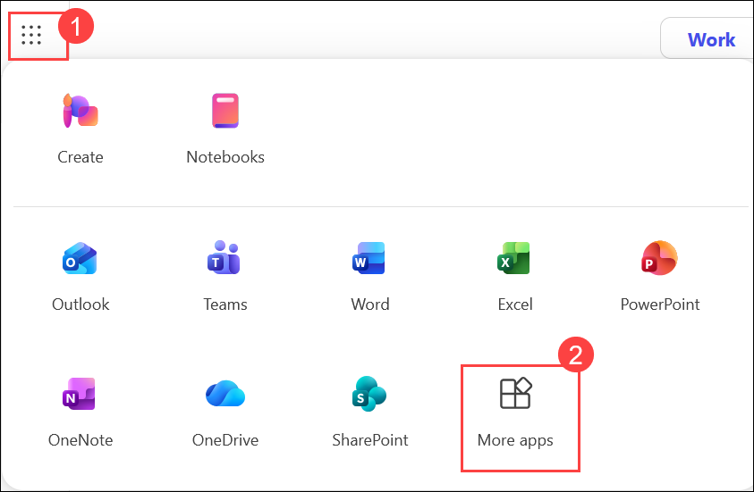
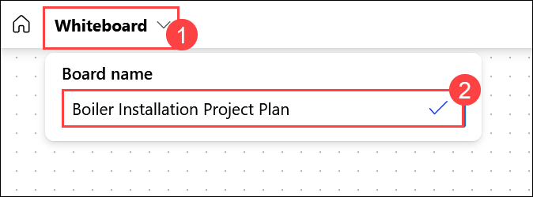
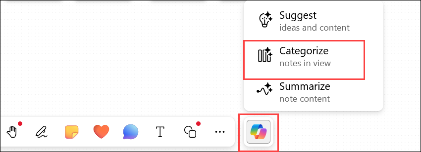
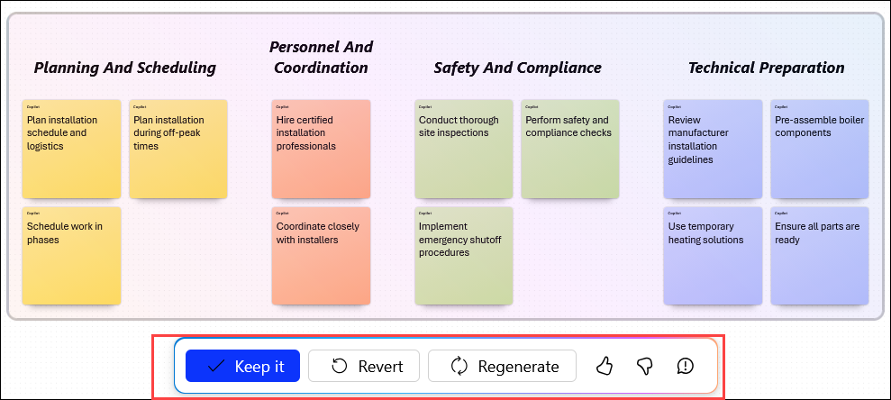

# Exercise 1: Use Copilot in Whiteboard to Brainstorm Project Plan Ideas

As the Operations Manager at Adatum Corporation, you are planning the replacement of an aging boiler system in a 50-year-old office building. Before beginning the installation process, you need to identify the activities, risks, dependencies, and operational considerations involved in the project.

Rather than conducting a traditional brainstorming workshop with multiple stakeholders, you will use Microsoft Copilot in Whiteboard to generate ideas, organize them into meaningful categories, identify risk mitigation activities, and summarize the results. This exercise demonstrates how Copilot can accelerate project planning and help transform unstructured ideas into an organized project framework.

## Lab Overview

In this hands-on lab, you will use **Microsoft Whiteboard** and **Microsoft 365 Copilot** to brainstorm and organize a boiler installation project. You will:

- Generate project activities using Copilot's Suggest feature.
- Identify risk mitigation strategies and downtime reduction recommendations.
- Organize brainstorming ideas into meaningful categories.
- Refine and regenerate AI-generated categorizations.
- Create a summary of the planning session.

By the end of this exercise, you will have a structured Whiteboard containing categorized project planning activities that can serve as the foundation for a formal project plan.

## Task 1: Brainstorm and Organize a Boiler Installation Project Plan Using Copilot in Whiteboard

In this task, you will create a Whiteboard session, use Copilot to generate and expand project planning ideas, add risk mitigation and downtime reduction recommendations, organize ideas into categories, and generate a summary of the brainstorming session.

## Steps

### Sign in and Open Whiteboard

1. Open **Microsoft Edge** and navigate to the Microsoft 365 home page:

    ```
    https://www.microsoft365.com
    ```

1. Enter the following credentials to sign in to Microsoft 365:

    - **Email/Username**: **<inject key="AzureAdUserEmail"></inject>**

    - **Password**: **<inject key="AzureAdUserPassword"></inject>**

1. In the Microsoft 365 portal, click on the **App launcher (1)** button and select **More apps (2)**, then select **Whiteboard (3)**.

    

    > **`Note:`** If Whiteboard doesn't appear in the initial list, use the search box or scroll through the complete list of Microsoft 365 applications.

1. In **Whiteboard for the web**, select **Create new Whiteboard**.

1. Select the default board name displayed at the top of the page (for example, *Whiteboard 1*) and rename it to:

    ```
    Boiler Installation Project Plan
    ```

    

### Generate Project Planning Ideas

1. Select the **Copilot** icon located in the bottom toolbar, then select **Suggest**.

    

1. In the **Suggest content with Copilot** pane, enter the following prompt and select **Generate**:

    ```
    I'm the Operations Manager at Adatum Corporation. Our 50-year-old office building has a failing boiler, and I need to evaluate options for repair or replacement. Before starting the installation process, I want to brainstorm and organize the typical steps companies should follow when installing a new boiler system. Using your expertise, please suggest a comprehensive list of actionable steps for a successful boiler installation project.
    ```

    > **`Note:`** This prompt demonstrates an effective structure that includes role, context, objective, and desired output. Use it as a model when creating future prompts throughout this exercise.

    

    > **`Tip:`** If Copilot returns an error such as **"Something went wrong. Please try again."** or **"Copilot couldn't process this prompt. Please rephrase it."**, try the following simplified prompts in order until one succeeds:
    >
    > **Option 1:**
    > ```
    > I'm the Operations Manager for Adatum Corporation. We're installing a new boiler in our company's heating system. Please suggest the steps we should follow to install the new boiler.
    > ```
    > **Option 2:**
    > ```
    > Create a list of the steps that a company should take to install a new boiler heating system.
    > ```
    > Sometimes Copilot works best with direct, single-action prompts. Once you receive a response, you can continue building on it with follow-up prompts.

1. Review the first six ideas generated by Copilot. Select **Generate more** to produce six additional ideas. The button now displays **Insert (12)**.

    

1. Review the notes and explore the available Whiteboard editing options. Select any note to access options such as:

    - Edit text
    - Change formatting
    - Lock a note
    - Delete a note

    

### Add Risk Mitigation Ideas

1. Select the **Copilot** icon and choose **Suggest**. Enter the following prompt and select **Generate**:

    ```
    Suggest ways to mitigate the risks of installing a new boiler into a commercial office building heating system.
    ```

    

1. Select **Generate more** until **12** risk mitigation ideas are available, then select **Insert (12)**.

    

1. If the newly inserted note grid overlaps existing notes, drag it to an empty area of the Whiteboard.

1. If any notes fall outside the visible canvas, select **Fit to Screen** in the lower-right corner of the page.

    

    > **`Note:`** You may need to select **Fit to Screen** multiple times until all content is visible.

1. Review the risk mitigation suggestions and make any desired edits. At this point, you should have approximately **24 brainstorming notes** on the Whiteboard.

### Categorize the Notes

1. Press **Ctrl + A** to select all notes on the canvas. Verify that all sticky notes are selected, including any that were previously outside the visible area. If necessary, drag the selected notes into view so that all notes are visible.

    

    > **`Warning:`** When categorizing notes, Whiteboard automatically selects only the notes currently visible on the canvas. Notes outside the current view will **not** be included in the categorization process. Always confirm all notes are visible before categorizing.

1. Select the **Copilot** icon and choose **Categorize**. In the **Categorize selected notes** window, select **Categorize**.

    

1. Review the generated categories. Observe how Copilot groups related notes together, creates category names automatically, and assigns different colors to each category.

    

1. If the categorized notes are difficult to read, select **Fit to Screen**.

1. Select **Regenerate** to create alternative categorizations. Repeat the regeneration process several times and observe how Copilot changes category names, note placement, and the number of categories.

    

1. If you want to return to the original uncategorized sticky notes at any point, select **Revert**.

1. When you are ready to continue, categorize the notes again by selecting **Copilot** > **Categorize** > **Categorize**. Regenerate categories as needed until you are satisfied with the organization, then select **Revert** to return to editing mode.

### Add Downtime Reduction Ideas

1. Select a note that is no longer relevant. Select the **More options (...)** menu and choose **Delete** to remove it.

    

1. Select the **Copilot** icon and choose **Suggest**. Enter the following prompt and select **Generate**:

    ```
    Suggest ways to limit heating system downtime when installing a new boiler.
    ```

    

1. Review the six ideas generated by Copilot, then select **Insert (6)**.

1. Move the new note grid if it overlaps existing content. If necessary, select **Fit to Screen** to ensure all notes remain visible.

    

### Final Categorization and Summary

1. Press **Ctrl + A** to select all notes. Select **Copilot** > **Categorize** > **Categorize**.

    

1. Review the categorization results. Select **Regenerate** as needed until you are satisfied with the organization, then select **Keep it**.

    Observe that each category is displayed using a distinct color for easy identification.

    

1. To generate a summary of the brainstorming session, select the **Copilot** icon and then select **Summarize**.

    

    > **`Note:`** During testing, Copilot sometimes generated a concise summary of the brainstorming session and other times was unable to generate a summary. Results may vary.

1. If a summary is generated and meets your expectations, select **Keep it**.

1. Select **Fit to Screen** to display all categorized notes and the summary on the Whiteboard canvas. Review the completed brainstorming session.

    

1. You have now completed **Exercise 1**.

## Summary

In this exercise, you used **Microsoft 365 Copilot in Whiteboard** to plan a boiler installation project at Adatum Corporation. You:

- Generated **project planning activities** using Copilot's Suggest feature with an effective, structured prompt.
- Expanded the session by adding **risk mitigation strategies** for a commercial boiler installation.
- Added **downtime reduction recommendations** to minimize heating system disruption during installation.
- Organized all ideas into **meaningful categories** using Copilot's Categorize feature.
- Refined and regenerated AI-generated categorizations to find the best groupings.
- Generated a **session summary** capturing the key outcomes of the brainstorming session.

The structured Whiteboard you created can now serve as the foundation for a formal project implementation plan.

## Key Takeaways

By completing this exercise, you learned how to:

- Use **Microsoft Whiteboard** and **Microsoft 365 Copilot** together for project planning.
- Generate and expand brainstorming ideas using AI-assisted, iterative prompting.
- Identify risks and mitigation strategies using Copilot suggestions.
- Organize large collections of ideas using Copilot's **Categorize** feature.
- Refine and regenerate AI-generated categories to improve structure.
- Generate session summaries to capture and communicate planning outcomes.
- Transform unstructured ideas into a structured project planning framework.

## Support Contact

The **CloudLabs support** team is available 24/7, 365 days a year, via email and live chat to ensure seamless assistance at any time. We offer dedicated support channels tailored specifically for both learners and instructors, ensuring that all your needs are promptly and efficiently addressed.

Learner Support Contacts:

- Email Support: [cloudlabs-support@spektrasystems.com](mailto:cloudlabs-support@spektrasystems.com)
- Live Chat Support: https://cloudlabs.ai/labs-support

Click **Next** from the bottom right corner to embark on your Lab journey!

