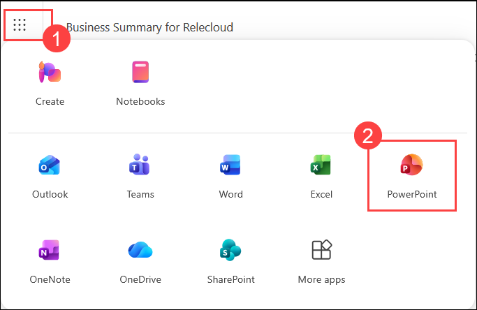
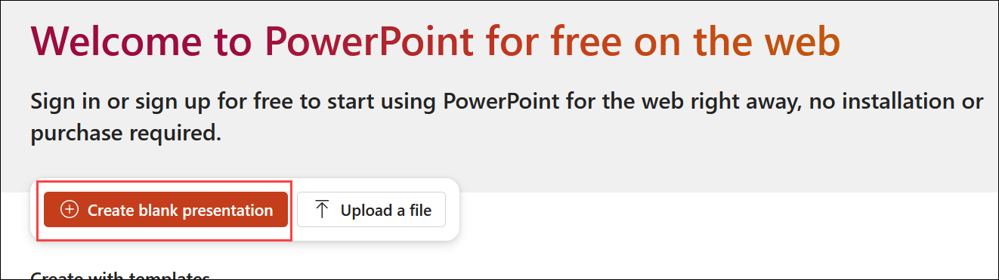

# Exercise 1, Task 3: Use Copilot in PowerPoint to Create an Executive Presentation

In the previous task, you used Microsoft 365 Copilot in Word to generate a **Heating System Comparison** report that analyzed the differences between boiler and furnace heating systems. You now need to present those findings to Adatum Corporation's senior leadership team.

To help leadership understand the advantages, disadvantages, costs, maintenance considerations, and operational impacts of each heating system, you will use Microsoft 365 Copilot in PowerPoint to create an executive-level presentation based on the report generated in the previous task.

This task also demonstrates how Copilot can generate presentations from existing content, add slides, create AI-generated images, and make direct edits within a PowerPoint presentation.

## Lab Overview

In this hands-on lab, you will use **Microsoft 365 Copilot in PowerPoint** to create an executive presentation from the Heating System Comparison report stored in OneDrive. You will:

- Generate a slide deck from existing source material.
- Modify and enhance presentation content using Copilot.
- Add AI-generated images to slides.
- Create new slides based on additional research.
- Finalize the presentation with a Q&A slide.

By the end of this task, you will have a complete executive presentation ready for leadership review.

> **`Important:`** Ensure you have completed **Exercise 1, Task 2: Use Copilot in Word to Compare Operational Reports** and that the **Heating System Comparison** report has been saved to your OneDrive before starting this task.

## Steps

### Open PowerPoint and Attach the Report

1. In your **Microsoft Edge** browser, navigate to the Microsoft 365 home page:

    ```
    https://www.microsoft365.com
    ```

1. Enter the following credentials to sign in to Microsoft 365:

    - **Email/Username**: **<inject key="AzureAdUserEmail"></inject>**

    - **Password**: **<inject key="AzureAdUserPassword"></inject>**

1. In the Microsoft 365 portal, click on the **App launcher (1)** button and select **PowerPoint (2)**.

    

1. In **PowerPoint for the web**, click on  **create a blank presentation**.

    

1. Select **Copilot** at the right bottom of the page and tap to open the Copilot pane.

    

1. In the Copilot prompt field, select the **plus (+)** sign and choose **Add work content** from the drop-down menu. Browse your **OneDrive** and attach the **Heating System Comparison** report created in the previous task.

    

1. Verify that the **Edit with Copilot** icon appears next to the **plus (+)** sign in the prompt field.

    > **`Note:`** If the icon is not visible, select the **plus (+)** sign and choose **Edit with Copilot** from the drop-down menu. The icon should now appear in the prompt field. When **Edit with Copilot** is enabled, Copilot can directly create and modify slides within the presentation.

    

### Generate the Executive Presentation

1. In the Copilot prompt field, enter the following prompt and select **Submit**:

    ```
    Create an executive leadership presentation based on the attached Heating System Comparison report.
    ```

    

1. If Copilot asks follow-up questions about the presentation, review and respond to each one. Questions may include:

    - Intended audience
    - Presentation purpose and style
    - Presentation length
    - Theme or slide template selection

    Select your preferred options and then select **Confirm**. If a second set of questions appears, answer them as desired or select **Skip all** to let Copilot use its best judgment.

    > **`Note:`** If no template is selected, Copilot may generate slides using a simple default format.

    

1. Wait while Copilot analyzes the report and generates the presentation. This may take several minutes.

    > **`Note:`** During testing, Copilot behavior varied. It sometimes generated the full slide deck automatically. Other times, it produced a slide outline first and asked for confirmation before proceeding. If you receive an outline, review the proposed structure and instruct Copilot to **proceed with slide generation**.

    

1. Review the generated presentation and verify that it covers the following areas:

    - Boiler and furnace system overviews
    - Energy efficiency considerations
    - Cost comparisons
    - Maintenance requirements
    - System conversion considerations
    - Executive recommendations

    If Copilot provides additional enhancement suggestions in the pane, review and apply any that you find useful.

    

### Add an AI-Generated Image

1. Locate a slide in the presentation that does not contain an image and select it in the slide thumbnail pane.

    

1. In the Copilot prompt field, enter the following prompt and select **Submit**:

    ```
    Generate an image related to the content on this slide and add it to the presentation.
    ```

    

1. Wait while Copilot generates and inserts the image. Verify that the image has been added to the selected slide.

    > **`Note:`** Image generation may take several minutes depending on service availability.

    

### Add a Lifespan Comparison Slide

1. Review the presentation and confirm there is no slide covering the expected lifespan of boiler versus furnace systems. In the slide thumbnail pane on the left, select the position where you want the new slide inserted. Verify that a red insertion line appears between the slides at your chosen location.

    

1. In the Copilot prompt field, enter the following prompt and select **Submit**:

    ```
    Research the expected lifespan of commercial boiler systems versus commercial furnace systems and add the information to a new slide.
    ```

    

1. Wait while Copilot creates the slide. Verify that the new slide is added at the intended location. If the slide appears in an incorrect position, drag and drop it into the desired location in the slide thumbnail pane.

    

### Add a Q&A Slide

1. Navigate to the end of the presentation and select the final slide in the deck to set the insertion point.

    

1. In the Copilot prompt field, enter the following prompt and select **Submit**:

    ```
    Add a Question and Answer (Q&A) slide after the final slide in the presentation.
    ```

    

1. Verify that Copilot creates the Q&A slide at the end of the deck. If the slide isn't placed at the end, drag it to the final position in the slide thumbnail pane.

    

1. Review the completed presentation and confirm it includes the following:

    - Executive summary and heating system comparisons
    - Cost and energy efficiency information
    - AI-generated visual
    - Lifespan comparison slide
    - Q&A slide at the end

1. You have now completed **Task 3**.

## Summary

In this task, you used **Microsoft 365 Copilot in PowerPoint** to transform the Heating System Comparison report into a leadership-ready executive presentation for Adatum Corporation. You:

- Generated a full **executive slide deck** from the Heating System Comparison report using **Edit with Copilot**.
- Responded to Copilot's follow-up questions to tailor the presentation style, audience, and theme.
- Added an **AI-generated image** to a content slide using a Copilot prompt.
- Created a new **lifespan comparison slide** based on additional research requested from Copilot.
- Added a **Q&A slide** to close the presentation for leadership discussion.

## Key Takeaways

By completing this task, you learned how to:

- Use **Copilot in PowerPoint** to generate presentations directly from existing Word documents.
- Tailor executive presentations by responding to Copilot's follow-up prompts.
- Apply **Edit with Copilot** to make in-place changes across a slide deck.
- Generate and insert **AI-created images** to enhance visual engagement.
- Add **research-based slides** for topics not covered in the source document.
- Accelerate executive presentation creation using Microsoft 365 Copilot.

## Support Contact

The **CloudLabs support** team is available 24/7, 365 days a year, via email and live chat to ensure seamless assistance at any time. We offer dedicated support channels tailored specifically for both learners and instructors, ensuring that all your needs are promptly and efficiently addressed.

Learner Support Contacts:

- Email Support: [cloudlabs-support@spektrasystems.com](mailto:cloudlabs-support@spektrasystems.com)
- Live Chat Support: https://cloudlabs.ai/labs-support

Click **Next** from the bottom right corner to proceed to the next task!

