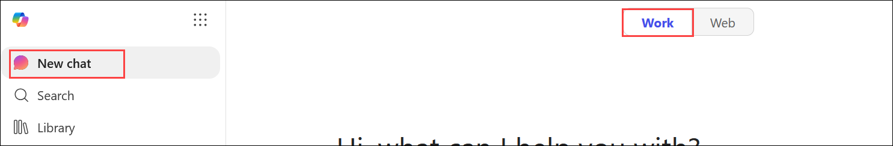
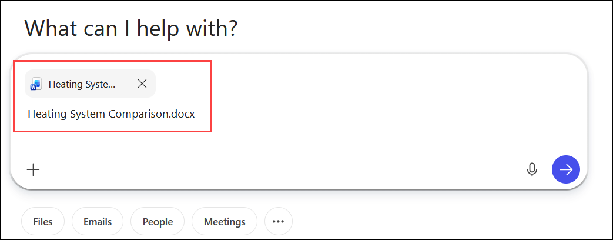
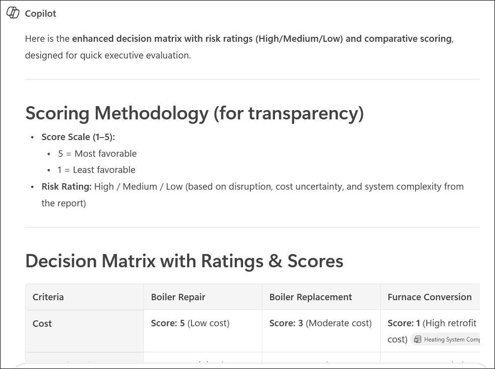
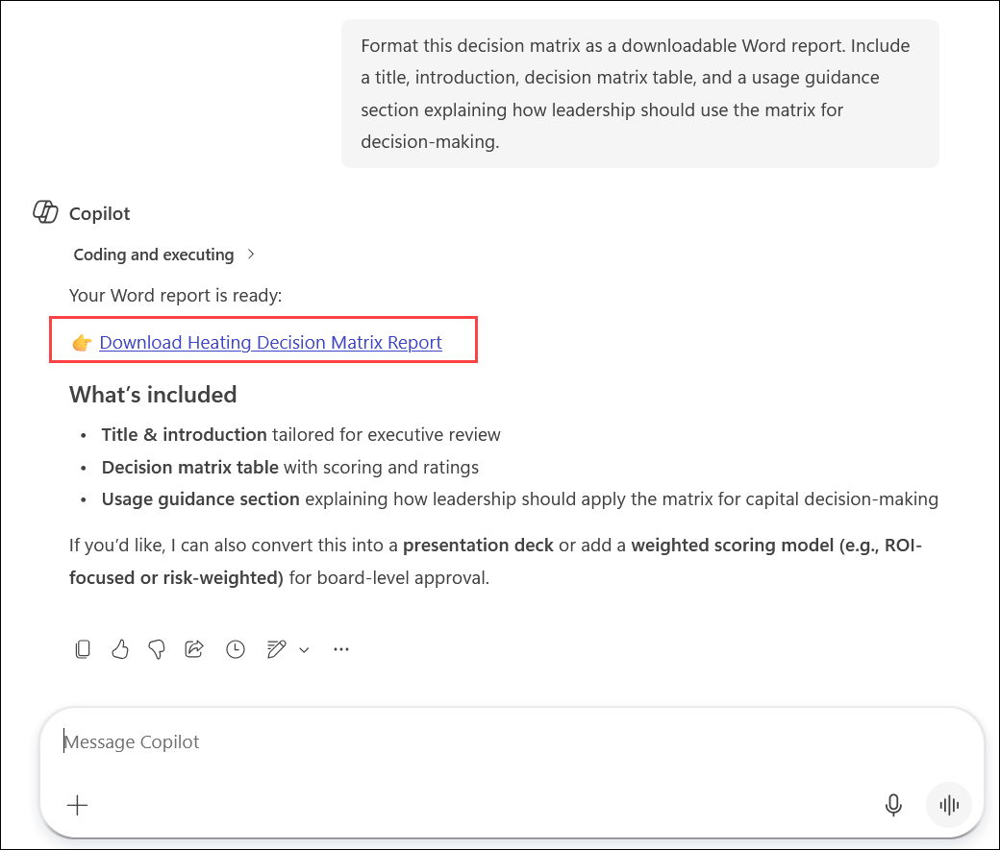
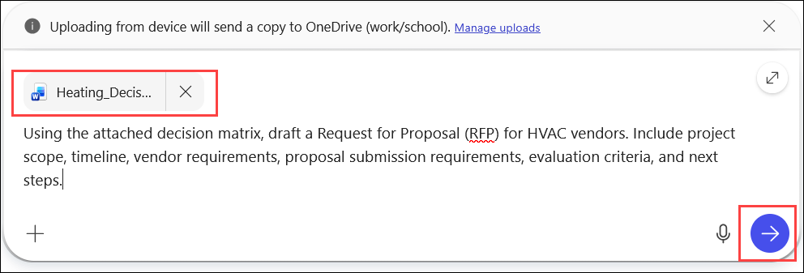
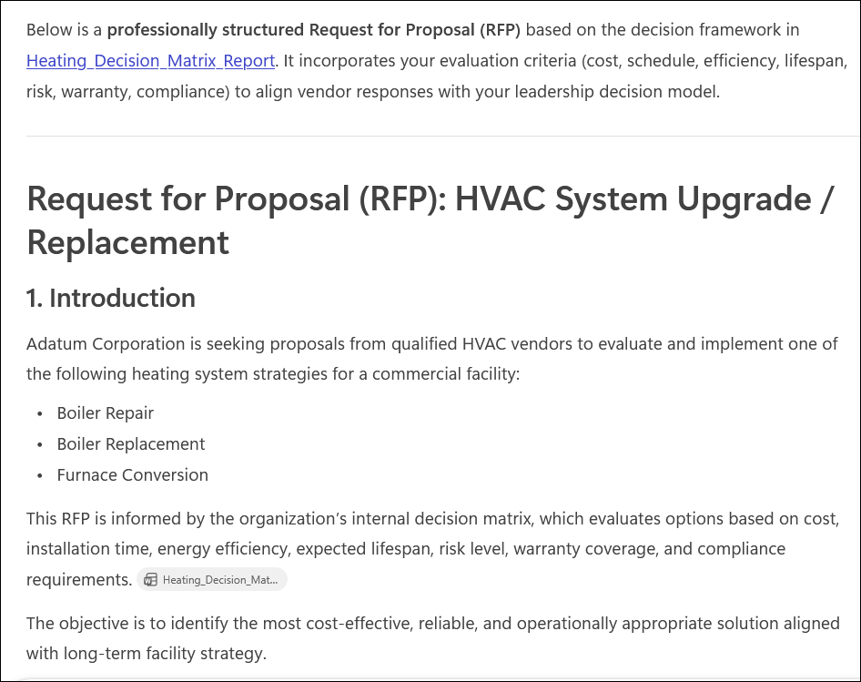
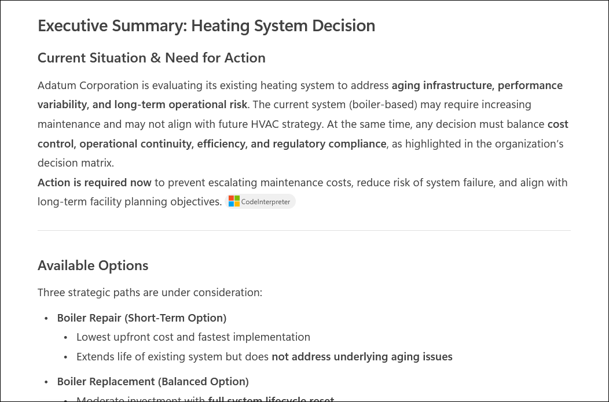
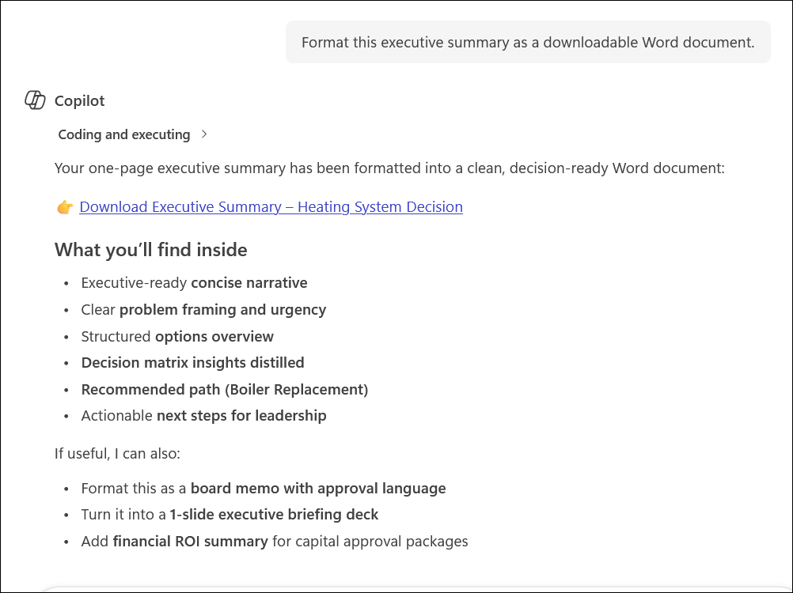

# Exercise 1, Task 4: Use Microsoft 365 Copilot Chat to Prepare for Vendor Engagement

Throughout the day, you used Microsoft 365 Copilot across multiple applications to support the evaluation of Adatum Corporation's aging heating system. You brainstormed project ideas in Whiteboard, researched heating system options in Word, and created an executive presentation in PowerPoint.

You now need to prepare for vendor engagement and leadership decision-making. To accomplish this, you will use **Microsoft 365 Copilot Chat** to consolidate information from your previous work into actionable business deliverables.

Your objectives are to create:

- A **decision matrix** comparing boiler repair, boiler replacement, and furnace conversion.
- A **Request for Proposal (RFP)** that can be sent to HVAC vendors.
- An **executive summary** that leadership can use to make an informed decision.

This task demonstrates how Microsoft 365 Copilot Chat can synthesize information from multiple Microsoft 365 files and transform that information into structured business outputs.

## Lab Overview

In this hands-on lab, you will use **Microsoft 365 Copilot Chat** to analyze information from previously created documents, generate decision-making tools, create a vendor RFP, and prepare an executive-ready summary. You will learn how Copilot Chat can use organizational content stored in Microsoft 365 to assist with planning, vendor selection, and executive communications.

> **`Important:`** Ensure you have completed the following tasks before starting, and that both files are saved to your **OneDrive**:
> - **Exercise 1, Task 2** — Heating System Comparison report
> - **Exercise 1, Task 3** — Executive presentation

## Steps

### Sign in and Open Copilot Chat

1. In your **Microsoft Edge** browser, navigate to the Microsoft 365 home page:

    ```
    https://www.microsoft365.com
    ```

1. Enter the following credentials to sign in to Microsoft 365:

    - **Email/Username**: **<inject key="AzureAdUserEmail"></inject>**

    - **Password**: **<inject key="AzureAdUserPassword"></inject>**

1. In Copilot Chat, select the **Work** option.

    > **`Note:`** Since this task involves reviewing a file uploaded to OneDrive and generating insights from that internal document, select the **Work** option. The **Web** option doesn't apply here, since it searches external sources like public websites and blogs.

    

1. In the Copilot prompt field, select the **attachment** icon and attach the **Heating System Comparison** file.

    

### Create a Decision Matrix

1. In the Copilot Chat prompt field, select the **attachment** icon and attach the **Heating System Comparison** report from your OneDrive.

    

1. Enter the following prompt and select **Submit**:

    ```
    Summarize the key decision factors from this report. Include cost, energy efficiency, downtime impact, and long-term maintenance considerations.
    ```

1. Review the decision criteria generated by Copilot. Verify that the response covers factors such as cost, energy efficiency, downtime impact, maintenance requirements, operational risk, and long-term value. Review any suggested follow-up prompts from Copilot and apply any that help refine the criteria further.

    

1. Once satisfied with the criteria, enter the following prompt and select **Submit**:

    ```
    Create a decision matrix that compares boiler repair, boiler replacement, and furnace conversion. Include columns for cost, installation time, energy efficiency, expected lifespan, and risk level. Use the decision criteria previously identified and focus on factors important to leadership, including cost, energy efficiency, downtime, and maintenance.
    ```

    

1. Review the generated decision matrix and verify that it compares all three options. Then enter the following prompt to expand the matrix and select **Submit**:

    ```
    Update the decision matrix by adding warranty terms and compliance requirements as additional evaluation criteria.
    ```

1. Review the updated matrix. To make it more actionable for leadership, enter the following prompt and select **Submit**:

    ```
    Assign High, Medium, or Low ratings for risk and provide comparative scoring for each option against the evaluation criteria.
    ```

    

1. Review the enhanced decision matrix and verify that each option now includes comparative scoring, risk ratings, warranty considerations, and compliance considerations. Apply any suggested follow-up prompts that further improve the matrix.

1. Once satisfied, enter the following prompt and select **Submit**:

    ```
    Format this decision matrix as a downloadable Word report. Include a title, introduction, decision matrix table, and a usage guidance section explaining how leadership should use the matrix for vendor evaluation and decision-making.
    ```

    

1. When Copilot provides a downloadable file, download the **Word document** and save it to your OneDrive. Verify that the document contains a title or heading, introduction, decision matrix table, and usage guidance section.

    

### Create the HVAC Vendor RFP

1. In the Copilot Chat prompt field, select the **attachment** icon and attach the **decision matrix Word document** that you just downloaded.

    

1. Enter the following prompt and select **Submit**:

    ```
    Using the attached decision matrix, draft a Request for Proposal (RFP) for HVAC vendors. Include project scope, timeline, vendor requirements, proposal submission requirements, evaluation criteria, and expected deliverables.
    ```

    

1. Review the generated RFP and verify that it includes the following sections:

    - Project background
    - Scope of work
    - Project timeline
    - Vendor qualifications
    - Evaluation criteria
    - Submission instructions

    Apply any of Copilot's suggested follow-up prompts that improve the quality or completeness of the RFP.

    

1. Once satisfied with the content, enter the following prompt and select **Submit**:

    ```
    Format the RFP as a downloadable Word document.
    ```

1. Download the generated **RFP Word document** and save it to your OneDrive. Verify that it is properly formatted and suitable for vendor distribution.

    

### Create the Executive Summary

1. In the Copilot Chat prompt field, enter the following prompt and select **Submit**:

    ```
    Create a one-page executive summary that:
    - Explains the current situation and why action is required
    - Describes the available options (repair, replace, or convert)
    - Highlights findings from the decision matrix
    - Recommends a preferred option
    - Identifies recommended next steps

    The summary should be concise, executive-focused, and decision-ready.
    ```

    

1. Review the generated executive summary and verify that it includes business context, available options, key comparison results, a recommended approach, and next-step recommendations. Apply any of Copilot's suggested prompts that improve clarity or executive readiness.

    

1. Once satisfied with the summary, enter the following prompt and select **Submit**:

    ```
    Format this executive summary as a downloadable Word document.
    ```

1. Download the generated **executive summary Word document** and save it to your OneDrive. Review the final document and verify it is appropriate for leadership review and decision-making.

    

1. You have now completed **Task 4** and **Exercise 1**.

## Summary

In this task, you used **Microsoft 365 Copilot Chat** in Work mode to transform the Heating System Comparison research into three leadership-ready business deliverables for Adatum Corporation. You:

- Summarized key decision factors from the Heating System Comparison report.
- Generated an enhanced **decision matrix** comparing boiler repair, boiler replacement, and furnace conversion across cost, efficiency, risk, warranty, and compliance criteria.
- Created an **HVAC vendor RFP** covering project scope, timeline, vendor qualifications, and evaluation criteria.
- Produced a **one-page executive summary** with a recommended course of action and next steps.
- Downloaded all three deliverables as formatted Word documents ready for distribution.

## Key Takeaways

By completing this task, you learned how to:

- Use **Microsoft 365 Copilot Chat** in Work mode to analyze organizational content stored in OneDrive.
- Generate structured **decision-making tools** from existing documents using iterative prompting.
- Create **vendor-ready RFP documents** using Copilot Chat.
- Develop **executive summaries** based on analytical findings.
- Convert Copilot responses into downloadable, formatted Word documents.
- Streamline planning, procurement, and executive communication using Microsoft 365 Copilot.

## Support Contact

The **CloudLabs support** team is available 24/7, 365 days a year, via email and live chat to ensure seamless assistance at any time. We offer dedicated support channels tailored specifically for both learners and instructors, ensuring that all your needs are promptly and efficiently addressed.

Learner Support Contacts:

- Email Support: [cloudlabs-support@spektrasystems.com](mailto:cloudlabs-support@spektrasystems.com)
- Live Chat Support: https://cloudlabs.ai/labs-support

Click **Next** from the bottom right corner to complete the lab!

